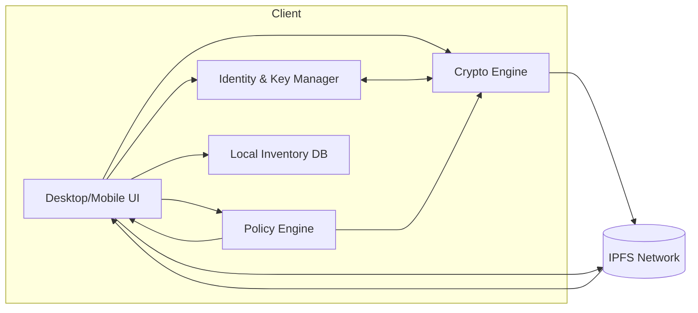
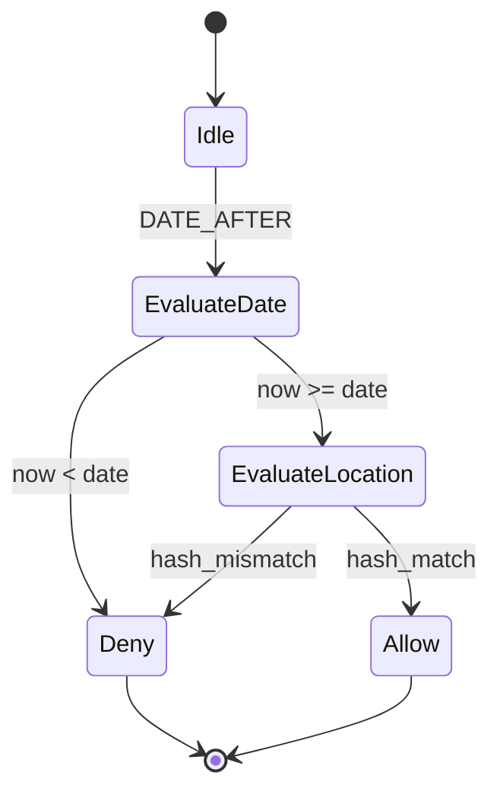
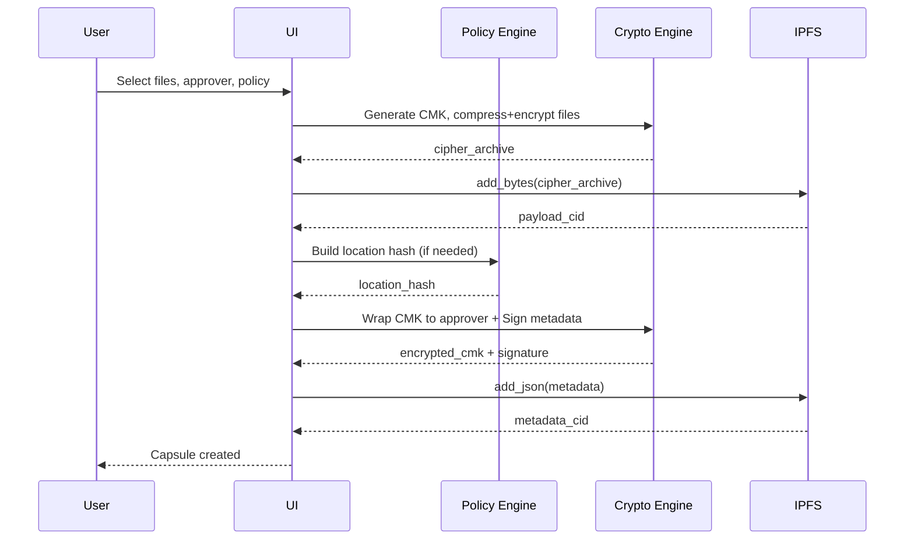

# TrustCircle Lite (TCL) — Full Build Specification

A fresh, end-to-end specification to build a simple, privacy-first, single-approver secure data sharing app. Includes concept, architecture, tech stack, data models, cryptography, flows, APIs, threat model, and implementation roadmap with Mermaid diagrams.

---

## 1) Concept

TrustCircle Lite (TCL) lets you lock files so that exactly one named approver can unlock them under specific environmental conditions (e.g., date/time and/or location). It is designed to feel like a physical safe: you need to be at the right time/place and hold the right private key.

Core objectives:
- Single approver: a single designated person has the authority to unlock.
- Two-factor by environment: unlock requires both device conditions and key possession.
- Local-first privacy: encryption and policy checks happen on the client before any access attempt.
- Decentralized storage: encrypted payloads and metadata are stored on IPFS for distribution without revealing private contents.

Non-goals (for v1):
- Multi-approver thresholds or quorum workflows.
- Server-side key escrow or recovery.
- Continuous background tracking of user location.

---

## 2) User Stories

- As a creator, I can encrypt files into a capsule and specify a single approver, plus optional time and location policy.
- As the approver, I can unlock a capsule when the local date/time and location match the policy and I possess the correct private key.
- As a creator, I can see the status of my capsules (Locked/Unlocked/Expired) locally.
- As an approver, I can verify the capsule’s metadata authenticity and policy before attempting unlock.

---

## 3) System Architecture Overview

- Client application performs all crypto and policy checks locally.
- Encrypted payloads and policy metadata are stored on IPFS.
- No central server is required to unlock or validate conditions.



Key interactions:
- Creation: UI -> Crypto Engine -> IPFS (upload encrypted payload + metadata).
- Unlock: UI -> IPFS (fetch metadata) -> Policy Engine (validate env) -> Crypto Engine (decrypt).

---

## 4) Technology Stack

- Platform: Python 3.11+
- UI: tkinter or customtkinter (desktop) — minimal, dependency-light
- Crypto: cryptography (Fernet for data, X25519/ECIES for key wrapping, Ed25519 for signing)
- Storage: ipfshttpclient to connect to a local IPFS daemon
- Geolocation: geopy (reverse geocoding optional), system location services for coordinates
- Local persistence: sqlite3 for inventory, preferences
- Packaging: PyInstaller for desktop bundling
- Logging: Python logging with PII-safe scrubber

Rationale: mature libraries, offline-capable, minimal external dependencies, reproducible builds.

---

## 5) Data Model

### 5.1 Capsule Components

- Encrypted Payload: compressed archive of user files, encrypted with a randomly generated Capsule Master Key (CMK).
- Metadata (JSON): public policy, recipient key, encrypted CMK, signatures, integrity nonces.

### 5.2 Metadata Schema (JSON)

```json
{
  "version": "1.0",
  "capsule_id": "uuid-v4-string",
  "creator_pubkey": "ed25519:BASE64_PUB",
  "approver_pubkey": "ed25519:BASE64_PUB",
  "payload_cid": "IPFS_CID_FOR_ENCRYPTED_ARCHIVE",
  "created_at": "2025-10-30T12:34:56Z",
  "unlock_policy": {
    "conditions": [
      {
        "type": "DATE_AFTER",
        "value": "2025-12-01T00:00:00Z"
      },
      {
        "type": "LOCATION_HASH_EQ",
        "value": "BASE64_HASH",
        "precision": 2,
        "algo": "SHA256",
        "salt": "BASE64_SALT"
      }
    ],
    "logic": "ALL" 
  },
  "encrypted_cmk": {
    "scheme": "x25519+chacha20poly1305",
    "ciphertext": "BASE64",
    "ephemeral_pub": "x25519:BASE64",
    "nonce": "BASE64"
  },
  "metadata_sig": {
    "alg": "ed25519",
    "signature": "BASE64"
  },
  "hints": {
    "title": "Taxes 2025",
    "notes": "Unlock at office"
  }
}
```

Notes:
- LOCATION_HASH generation: hash(salt || round(lat, precision) || round(lon, precision) || day_utc) with precision digits for decimal degrees; day_utc = YYYY-MM-DD.
- The metadata_sig covers all fields except itself to prevent tampering.
- The encrypted CMK is wrapped to the approver’s public key.

---

## 6) Cryptographic Design

- Data Encryption: CMK (32 bytes) -> Fernet (AES-128 in CBC + HMAC; or use AES-256-GCM directly if preferred). Default to Fernet for simplicity; alternative available via config.
- CMK Wrapping: ECIES-style using X25519:
  - Sender generates ephemeral X25519 key pair.
  - Derive shared secret with approver’s X25519 public key.
  - KDF: HKDF-SHA256 -> 32-byte key.
  - AEAD: ChaCha20-Poly1305 to encrypt CMK with random nonce.
  - Store ciphertext + ephemeral public + nonce in metadata.encrypted_cmk.
- Identity:
  - Ed25519 key pair for signing metadata.
  - Optional separate X25519 key pair for key agreement (or derive via libsodium conversion).
- Metadata Integrity:
  - metadata_sig.signature = Ed25519Sign(serialize(metadata_without_signature)).
- Policy Privacy:
  - Location details reduced to salted hash; actual coordinates never stored.

Key sizes:
- Ed25519/X25519: 32-byte keys.
- HKDF: info label “TCL-CMK-WRAP”.
- Nonce: 12 bytes (AEAD).

---

## 7) Application Flows

### 7.1 Capsule Creation

```mermaid
flowchart TD
  A[Create Capsule] --> B[Select files + title + notes]
  B --> C[Choose approver (pubkey)]
  C --> D[Set policy: date/location]
  D --> E[Generate CMK]
  E --> F[Compress + Encrypt files with CMK]
  F --> G[Upload encrypted payload to IPFS -> payload_cid]
  G --> H[Generate location_hash (if any)]
  H --> I[Wrap CMK for approver using X25519+AEAD]
  I --> J[Assemble metadata JSON]
  J --> K[Sign metadata with Ed25519]
  K --> L[Upload metadata JSON to IPFS -> metadata_cid (optional) or store locally]
  L --> M[Save local record (capsule_id, cids, status=Locked)]
  M --> N[Show success + share link/QR with metadata]
```

Optional: store metadata JSON also on IPFS. If metadata is sensitive, keep local and share out-of-band.

### 7.2 Capsule Unlock (Approver)

```mermaid
flowchart TD
  U[Open Capsule] --> V[Fetch metadata (local or IPFS)]
  V --> W[Verify metadata signature]
  W -->|fail| X[Abort: Tampered Metadata]
  W --> Y[Check policy conditions]
  Y -->|fail| Z[Access Denied: Policy Not Met]
  Y --> AA[Fetch encrypted payload from IPFS]
  AA --> AB[Unwrap CMK with private key]
  AB -->|fail| AC[Abort: Not Authorized]
  AB --> AD[Decrypt payload with CMK]
  AD --> AE[Extract files to user folder]
  AE --> AF[Mark local status=Unlocked]
```

### 7.3 Policy Evaluation



---

## 8) Module Design and APIs

### 8.1 Identity & Key Manager

- generate_identity(): returns {ed25519_keypair, x25519_keypair}
- load_identity(store): returns keys from local secure storage
- export_public_profile(): {creator_pubkey_ed25519, approver_pubkey_ed25519, x25519_pub}

### 8.2 Policy Engine

- build_location_hash(lat, lon, date_utc, precision, salt, algo="SHA256") -> base64
- evaluate(policy, device_context) -> {pass: bool, failures: [string]}
- device_context: {now_utc, lat, lon}

### 8.3 Crypto Engine

- encrypt_payload(files[]) -> {cipher_archive_bytes, cmk, archive_manifest}
- decrypt_payload(cipher_archive_bytes, cmk) -> files[]
- wrap_cmk_for_recipient(cmk, recipient_x25519_pub) -> {ciphertext, ephemeral_pub, nonce}
- unwrap_cmk(ciphertext, recipient_x25519_priv, ephemeral_pub, nonce) -> cmk
- sign_metadata(metadata_without_sig, ed25519_priv) -> signature
- verify_metadata(metadata, ed25519_pub) -> bool

### 8.4 IPFS Client

- add_bytes(bytes) -> cid
- add_json(obj) -> cid
- get_bytes(cid) -> bytes
- get_json(cid) -> obj

### 8.5 Inventory & Persistence

- save_capsule(record)
- update_status(capsule_id, status)
- list_capsules(filters)

Record fields:
- capsule_id, title, notes, payload_cid, metadata_cid?, created_at, approver_pubkey, status

---

## 9) Error Model and UX Copy

- Tampered Metadata: “This capsule’s details are invalid. It may have been altered.”
- Policy Not Met: 
  - Date: “This capsule isn’t available yet.”
  - Location: “You’re not in the required unlock area.”
- Unauthorized: “Your key doesn’t match the authorized approver.”
- Network: “Unable to reach IPFS. Check connectivity or local daemon.”

All errors should be non-technical, with a “Details” toggle for logs.

---

## 10) Threat Model

Adversaries:
- Passive observer of IPFS: sees encrypted payloads and metadata.
- Active modifier: attempts to replace metadata or payload.
- Unauthorized local user: tries to unlock without private key.
- Location spoofing attempts.

Assets:
- CMK, decrypted files, policy integrity, approver identity.

Risks & Mitigations:
- Metadata tampering -> Ed25519 signature verification on metadata.
- Payload substitution -> Optional payload manifest hash included in metadata; verify on download.
- Key theft -> OS keystore integration (optional), passphrase-protected private keys, minimal key export paths.
- Location spoofing -> Use salted, coarse-grained hash; allow optional secondary factors (date + location). Encourage real device location APIs; warn if mock providers detected.
- Traffic analysis -> Client-side encryption; metadata reveals only hashes and public keys. Option to keep metadata off IPFS (share out-of-band).
- Replay attacks -> Nonces in CMK wrap; signed timestamps; versioned metadata.

---

## 11) Privacy Considerations

- Never store raw coordinates in metadata; only salted hashes.
- Keep location precision coarse (1–3 decimal places) to reduce specificity.
- Optional: allow unlock with only DATE_AFTER for users in sensitive regions.
- No telemetry by default; optional opt-in for anonymous error reporting.

---

## 12) Performance & Reliability

- Payload size: compress before encrypt for smaller CIDs.
- Streaming encryption/decryption for large archives to reduce memory usage.
- Retry/backoff for IPFS interactions.
- Local cache for recently accessed payloads with integrity checks.

---

## 13) Build & Packaging

- Environments: dev (debug), prod (optimized).
- Config via .env or settings.json (IPFS API URL, default precision).
- Packaging: PyInstaller to single-file executable per OS.
- Code signing recommended for distribution.

---

## 14) Testing Strategy

- Unit tests:
  - Crypto primitives (wrap/unwrap CMK; deterministic failures).
  - Policy evaluation (edge dates, precision rounding).
  - Metadata signing/verification.
- Integration tests:
  - Full create->upload->unlock loop with local IPFS.
  - Tampering scenarios (modified metadata, wrong approver key).
- E2E tests:
  - Simulated geolocation and clock scenarios.
  - Large payloads.
- Security tests:
  - Fuzzing of metadata parser.
  - Negative tests for nonce reuse, KDF misuse.

---

## 15) MVP Scope

- Single approver.
- DATE_AFTER and LOCATION_HASH_EQ conditions with ALL logic.
- Local-only identity with exportable public keys.
- Encrypted payload upload to IPFS.
- Optional: metadata on IPFS or shared off-band.
- Desktop UI with simple flows.

Out of scope for MVP:
- Mobile clients.
- Recovery flows, multi-approver, remote policy updates.

---

## 16) Roadmap

- Phase 1: Core crypto + policy engine + IPFS client + CLI skeleton
- Phase 2: Desktop UI; create and unlock flows; inventory
- Phase 3: Hardening, UX polish, packaging; test suite
- Phase 4: Enhancements (payload manifest, OS keychain, optional mobile)

---

## 17) Example CLI (for development)

- tcl gen-keys -> generates ed25519/x25519 pair
- tcl create --files ./docs --title "Taxes 2025" --approver-pub <pub> --date "2025-12-01" --loc "hash:BASE64,prec=2,salt=BASE64"
- tcl show <capsule_id>
- tcl unlock <capsule_id> --output ./out

---

## 18) Example Pseudocode

Creation:

```python
cmk = os.urandom(32)
archive = compress(files)
cipher_archive = fernet_encrypt(cmk, archive)
payload_cid = ipfs.add_bytes(cipher_archive)

loc_hash = build_location_hash(lat, lon, date_utc, precision, salt) if use_location else None
policy = build_policy(date_after, loc_hash)

wrap = wrap_cmk_for_recipient(cmk, approver_x25519_pub)
metadata = assemble_metadata(..., payload_cid, policy, wrap)
metadata_sig = ed25519_sign(serialize(metadata_wo_sig), creator_ed25519_priv)
metadata["metadata_sig"] = {"alg":"ed25519", "signature": b64(metadata_sig)}

metadata_cid = ipfs.add_json(metadata)
save_inventory(...)
```

Unlock:

```python
metadata = load_metadata()
assert verify_metadata(metadata, metadata["creator_pubkey"])

if not evaluate(metadata["unlock_policy"], device_context()):
    raise PolicyError

cipher_archive = ipfs.get_bytes(metadata["payload_cid"])
cmk = unwrap_cmk(metadata["encrypted_cmk"], approver_x25519_priv)
archive = fernet_decrypt(cmk, cipher_archive)
extract(archive, output_dir)
```

---

## 19) Mermaid Sequence Diagrams

Create Capsule (detailed):



Unlock Capsule (detailed):

```mermaid
sequenceDiagram
  participant A as Approver
  participant UI as UI
  participant POL as Policy Engine
  participant ENC as Crypto Engine
  participant IP as IPFS
  A->>UI: Open capsule
  UI->>IP: get_json(metadata_cid) or local
  IP-->>UI: metadata
  UI->>ENC: Verify metadata signature
  ENC-->>UI: ok
  UI->>POL: Evaluate policy (date/location)
  POL-->>UI: pass/fail
  alt pass
    UI->>IP: get_bytes(payload_cid)
    IP-->>UI: cipher_archive
    UI->>ENC: Unwrap CMK with approver private key
    ENC-->>UI: CMK
    UI->>ENC: Decrypt archive
    ENC-->>UI: files
    UI-->>A: Files available
  else fail
    UI-->>A: Access