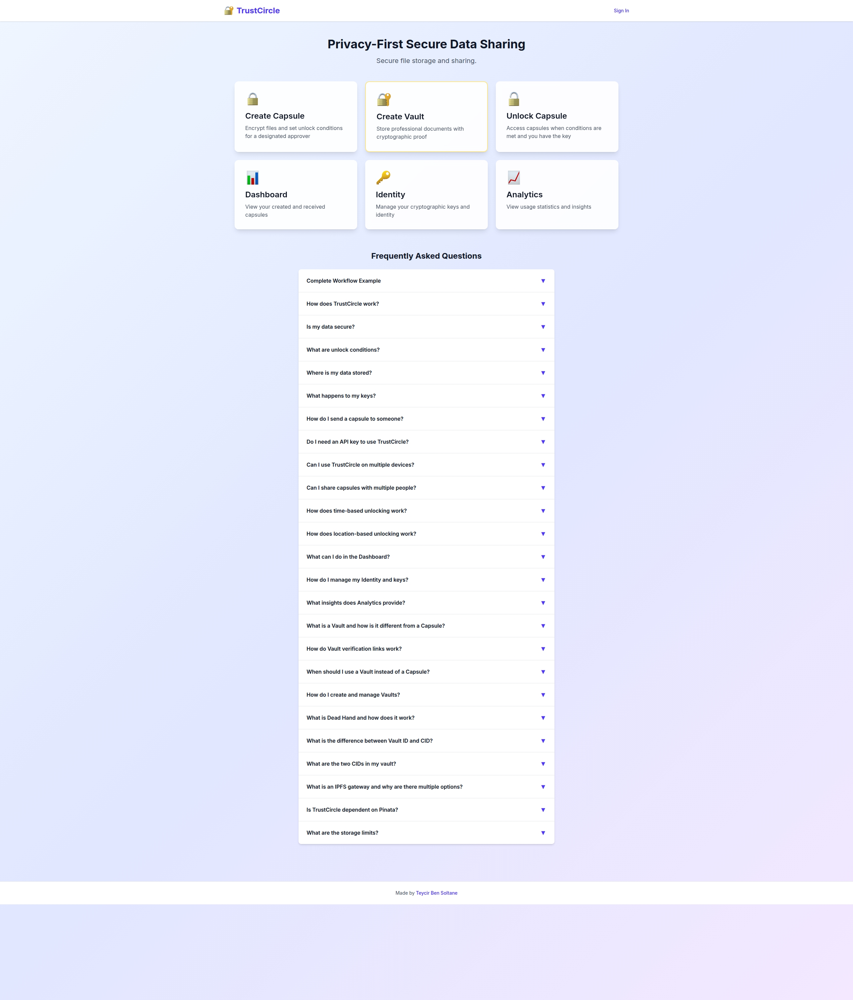
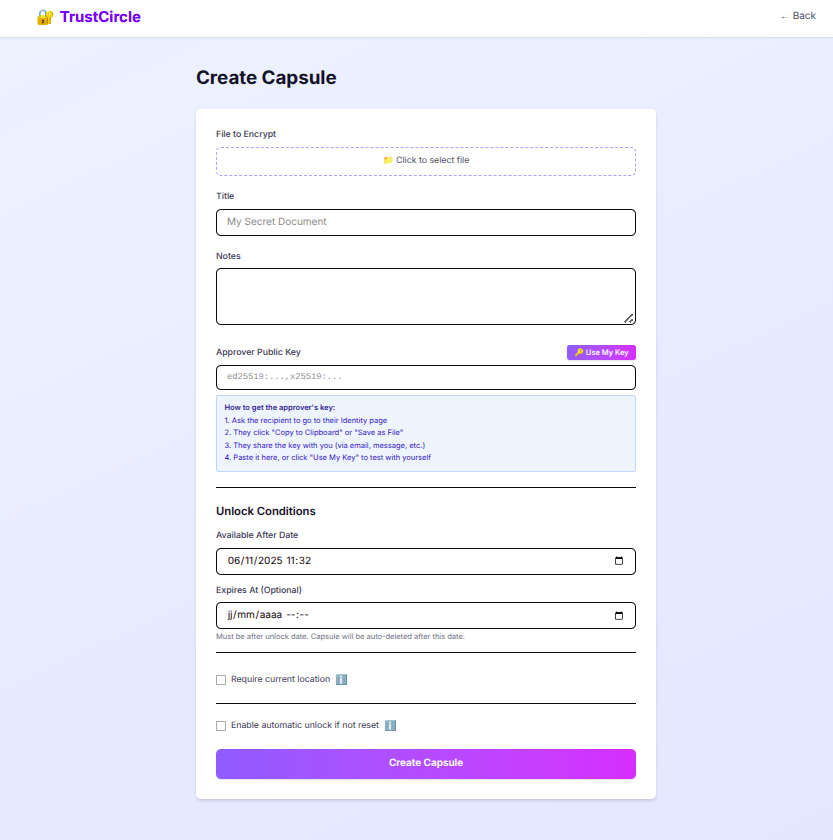
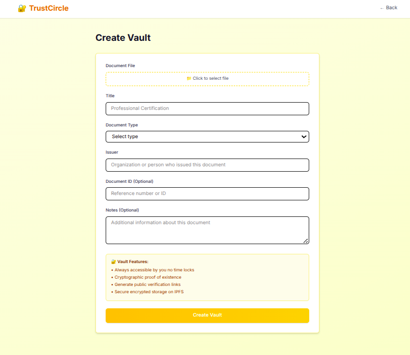
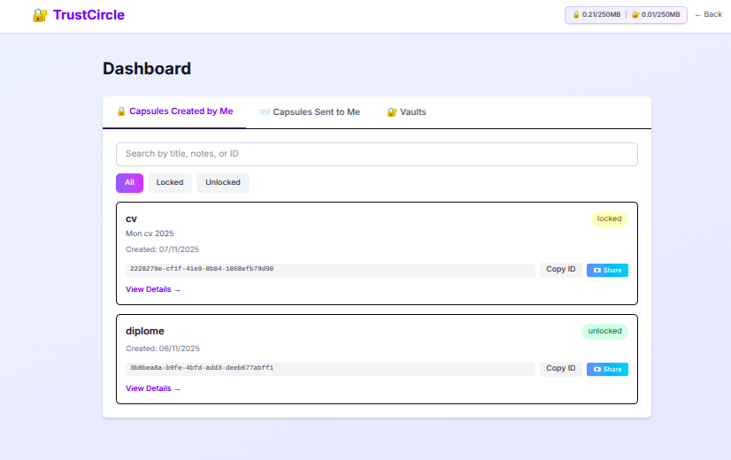
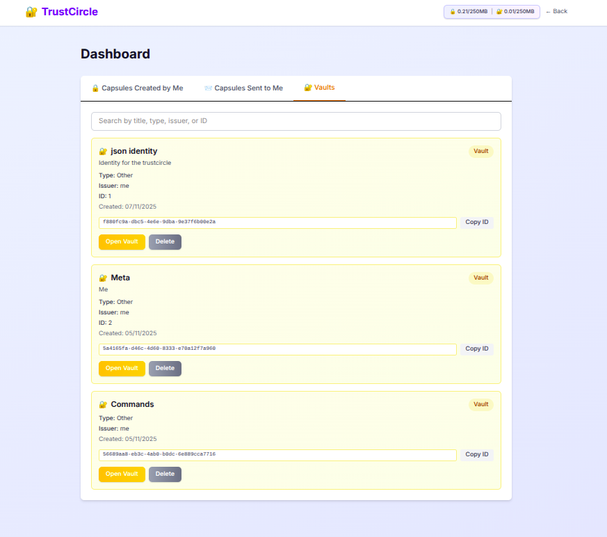
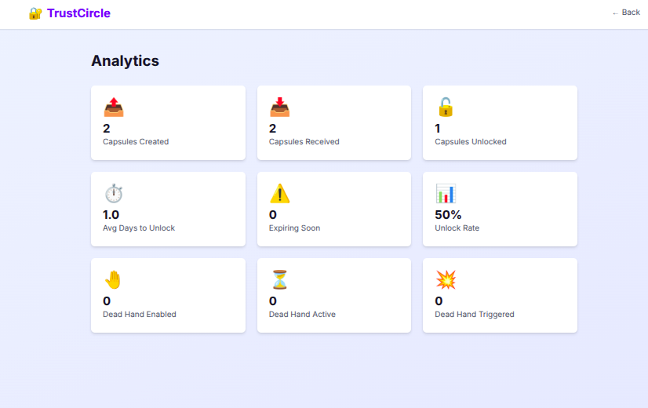
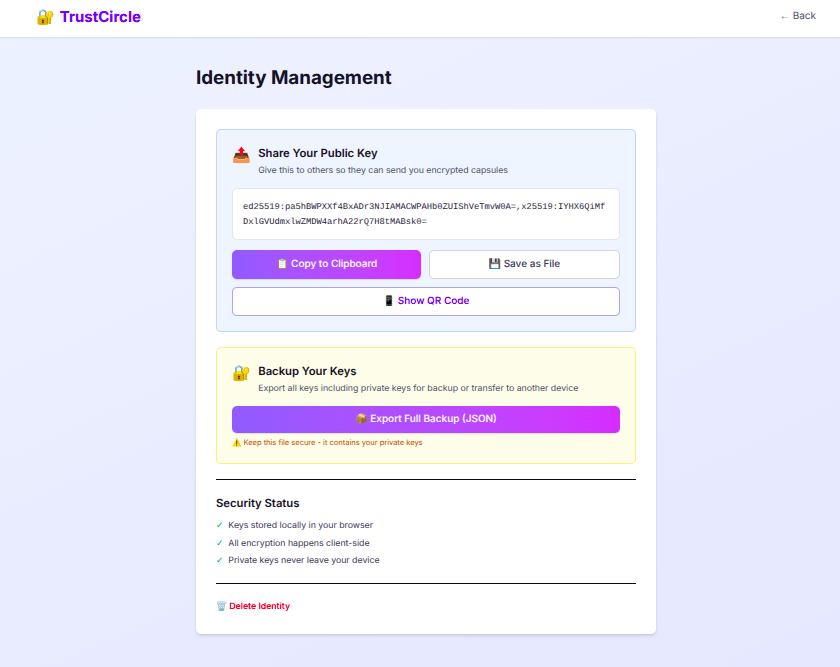
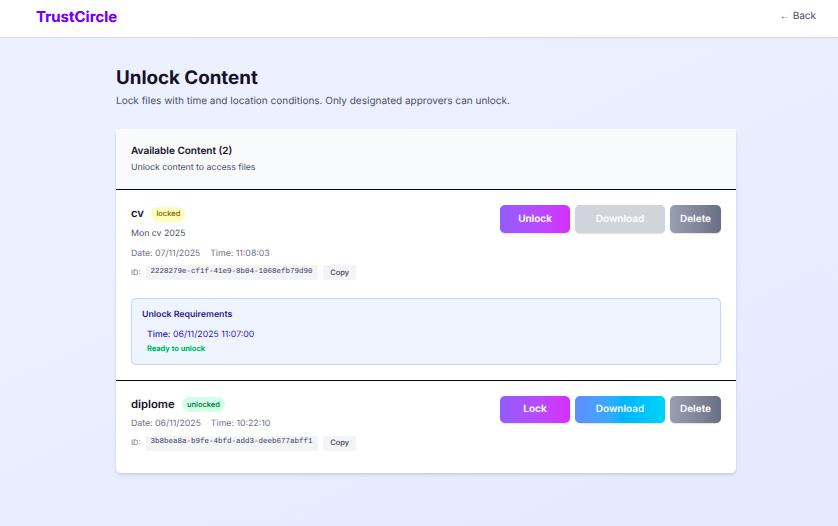

# TrustCircle

<div align="center">


</div>

<div align="center">

<a href="https://www.youtube.com/watch?v=F8JxKGnXrNY">
  
</a>

**[▶️ Watch the TrustCircle Demo](https://www.youtube.com/watch?v=F8JxKGnXrNY)**

</div>

<div align="center">

## 🔐 Send Files to the Future. Prove Documents Forever.

**TrustCircle** is a privacy-first platform for secure file sharing with time-locks, location restrictions, and cryptographic proof. Create encrypted capsules that unlock only when your conditions are met, or store documents with eternal verification links—all with client-side encryption that keeps your data truly private.

**🎯 Perfect for:** Estate planning • Legal contracts • Scheduled releases • Emergency access • Professional credentials • Dead hand protocols

</div>

<p align="center">
  
</p>

---

## ✨ Why TrustCircle?

**Capsules - Conditional Sharing:**
- **⏰ Time-Locked Delivery** - Send files that unlock at specific dates for scheduled releases or future delivery.
- **📍 Location-Based Access** - Require recipients to be at GPS coordinates to unlock sensitive documents.
- **💀 Dead Hand Protocol** - Automatically unlock capsules if you become inactive—your digital legacy, protected.

**Vaults - Permanent Storage:**
- **💼 Professional Documents** - Store certifications, contracts, diplomas with instant access anytime.
- **✅ Public Verification** - Generate shareable proof links that verify documents without revealing content.
- **🌐 Eternal Proof** - IPFS-based verification that survives even if TrustCircle disappears.

**Universal Security:**
- **🔒 Zero-Knowledge Encryption** - All files encrypted in your browser before upload. We never see your data.
- **🔑 Client-Side Keys** - Your encryption keys never leave your device. True end-to-end encryption.

---

## 📦 Capsules - Time-Locked File Sharing

<p align="center">
  
</p>

### Features

- ✅ **Client-Side Encryption**: AES-256-GCM encryption in browser
- ✅ **Time-Based Unlocking**: Set unlock dates for future access
- ✅ **Location-Based Unlocking**: Require specific GPS location with 1km radius
- ✅ **Designated Approver**: Only one person can decrypt with their private key
- ✅ **Dead Hand Protocol**: Automatic unlock if owner becomes inactive
- ✅ **Auto-Expiration**: Optional capsule expiration dates
- ✅ **Dashboard Management**: Track created and received capsules
- ✅ **Search & Filter**: Find capsules by title, notes, or status
- ✅ **QR Code Sharing**: Share public keys via QR code

### Use Cases

- Scheduled secure file delivery
- Time-sensitive information release
- Location-restricted document access
- Estate planning and digital legacy
- Emergency access to critical information
- Business continuity planning
- Conditional file sharing with approval

---

## 🔐 Vaults - Professional Document Storage

<p align="center">
  
</p>

### Features

- ✅ **Instant Access**: No waiting period, access documents anytime
- ✅ **Document Metadata**: Store type, issuer, document ID, timestamp
- ✅ **Public Verification**: Generate shareable proof links
- ✅ **Cryptographic Proof**: IPFS CID provides immutable content verification
- ✅ **Separate Storage**: Dedicated IPFS storage isolated from capsules
- ✅ **Content Addressing**: CID-based retrieval ensures data integrity

### Use Cases

- Professional certifications and credentials
- Legal contracts and agreements
- Academic diplomas and transcripts
- Professional licenses
- Important business documents
- Proof of document existence for legal purposes

---

## 📊 Dashboard & Analytics

<p align="center">
  
</p>

Manage all your capsules and vaults from a unified dashboard:

- View created and received capsules
- Track vault documents with metadata
- Monitor unlock conditions and expiration dates
- Search and filter by title, notes, or status
- Copy IDs to share with others
- Delete items you no longer need

<p align="center">
  
</p>

<p align="center">
  
</p>

---

## 🔑 Identity Management

<p align="center">
  
</p>

Your cryptographic identity is generated entirely in your browser:

- Generate Ed25519 and X25519 key pairs locally
- Export keys for backup
- Import keys on other devices
- Share public keys via QR code
- No server communication required

---

## 🔓 Unlocking Capsules

<p align="center">
  
</p>

Capsules unlock when all conditions are met:

1. Time condition: Current date/time is after unlock date
2. Location condition (optional): Within specified GPS radius
3. Approver verification: You have the matching private key

---

## 📖 How It Works

### Complete Workflow Example

Alice wants to send a confidential document to Bob that can only be opened on December 1st:

1. Bob goes to Identity page and copies his public key
2. Bob shares his public key with Alice
3. Alice goes to Create Capsule page
4. Alice uploads her document and sets unlock date to December 1st
5. Alice pastes Bob's public key in the Approver field
6. Alice creates the capsule and copies the Capsule ID
7. Alice shares the Capsule ID with Bob
8. Bob sees the capsule in his Dashboard under Received
9. On December 1st, Bob clicks Unlock and downloads the decrypted document

The file was encrypted in Alice's browser and only Bob can decrypt it with his private key.

---

## ❓ Frequently Asked Questions

### Is my data secure?

Yes. All encryption happens client-side in your browser using AES-256-GCM. Your files are encrypted before leaving your device, and only you and the designated approver have the keys.

### Where is my data stored?

Encrypted files are pinned to IPFS via Pinata. While IPFS uses content addressing, Pinata is currently the only service storing your data. Capsules and Vaults use separate Pinata accounts for isolation. Metadata is stored on Supabase. Your encryption keys never leave your browser.

### Do I need an API key to use TrustCircle?

No. As a user, you don't need any API keys. Key generation happens entirely in your browser. API keys are only needed by whoever deploys the website for Pinata and Supabase, not by end users.

### Can I use TrustCircle on multiple devices?

Yes. Export your keys from one device and import them on another to use the same identity everywhere.

### What is Dead Hand and how does it work?

Dead Hand automatically unlocks capsules if you become inactive:

- Set a trigger date when creating a capsule
- Receive warning 2 days before trigger
- 2-day grace period after trigger date
- Auto-unlock if not reset during grace period
- Perfect for estate planning and emergency access

### What are the storage limits?

- Personal limit: 250MB for capsules, 250MB for vaults
- Global limit: 1GB total capsules, 1GB total vaults
- Storage usage shown in navigation bar
- Delete old items to free space

### How do Vault verification links work?

Verification links prove a document exists without revealing its contents:

- Shows: document type, issuer, timestamp, IPFS CID
- Does NOT show: encrypted content, decryption keys
- Anyone can verify but not access content
- Perfect for proving credentials to employers

### Is TrustCircle dependent on Pinata?

Yes, currently. TrustCircle uses Pinata to pin content to IPFS. While the CID is a permanent content identifier, the actual data is only stored on Pinata's servers unless you or others also pin it. The CID verifies content integrity and allows migration to other IPFS pinning services, but doesn't guarantee availability if Pinata stops hosting the data.

---

## 👨‍💻 For Developers

### Tech Stack

- **Frontend**: Next.js 14, React 18, TypeScript, Tailwind CSS
- **Database**: Supabase with Row Level Security
- **Storage**: IPFS via Pinata (dual accounts for capsules/vaults)
- **Encryption**: AES-256-GCM, Ed25519, X25519
- **Testing**: Vitest, Playwright

### Quick Start

```bash
# Clone and install
git clone https://github.com/yourusername/TrustCircle.git
cd TrustCircle
npm install

# Configure environment
cp .env.example .env.local
# Edit .env.local with your credentials

# Setup database
# Run scripts/setup-config.sql in Supabase SQL Editor
# Then run scripts/setup-config.local.sql

# Run development server
npm run dev

# Run tests
npm test
```

### Configuration

API credentials stored in Supabase `app_config` table:

1. Run `supabase/sql/app-config-schema.sql` to create table
2. Run `scripts/setup-config.sql` for schema with placeholders
3. Run `scripts/setup-config.local.sql` with actual credentials
4. Environment variables in `.env.local` take priority

Dual IPFS storage:
- Capsules: Primary Pinata account (PINATA_JWT)
- Vaults: Secondary Pinata account (PINATA_VAULT_JWT)

See [SETUP.md](SETUP.md) for detailed configuration.

### Docker Deployment

```bash
cp .env.example .env
# Edit .env with your credentials
docker compose up -d
```

Access at: http://localhost:3001-3004

See [DOCKER.md](DOCKER.md) for complete Docker documentation.

### Vercel Deployment

See [DEPLOYMENT.md](DEPLOYMENT.md) for Vercel deployment instructions.

---

## 🏗️ Architecture

### Key Generation

User cryptographic keys generated entirely client-side:

- Ed25519 key pair for signing metadata
- X25519 key pair for key agreement
- Keys stored locally in IndexedDB
- No server communication required
- Export/import for multi-device usage

### Data Flow

**Capsules:**
```
Create: Browser Crypto -> Pinata IPFS -> Supabase metadata
Unlock: Supabase metadata -> Pinata IPFS -> Browser Crypto decrypt
```

**Vaults:**
```
Create: Browser Crypto -> Pinata Vault IPFS -> Supabase vaults table
Access: Supabase vaults table -> Pinata Vault IPFS -> Browser Crypto decrypt
Verify: Supabase vaults table -> Public metadata only no decryption
```

### Security

- **Data Encryption**: AES-256-GCM with random CMK
- **CMK Wrapping**: ECIES-style using X25519 ECDH
- **Metadata Integrity**: Ed25519 signatures
- **Policy Privacy**: Location details reduced to salted hash
- **No RPC**: Direct Supabase queries for simplicity

### Performance Optimizations

- **Analytics Cache**: 5-minute TTL, instant repeat loads
- **List Cache**: Dashboard loads cached for 5 minutes
- **Capsule Cache**: Individual capsule details cached
- **Smart Invalidation**: Cache cleared on mutations
- **Parallel Queries**: Promise.all for analytics
- **Database Aggregation**: Count queries instead of full data fetch

---

## 🗄️ Database Schema

**Capsules Table:**

```sql
create table capsules (
  id uuid primary key default gen_random_uuid(),
  creator_pubkey text not null,
  approver_pubkey text not null,
  title text,
  notes text,
  payload_cid text not null,
  metadata jsonb not null,
  status text default 'locked',
  created_at timestamp default now(),
  unlocked_at timestamp,
  expires_at timestamp,
  dead_hand_trigger_date timestamp,
  dead_hand_status text,
  warning_sent_at timestamp
);
```

**Vaults Table:**

```sql
create table vaults (
  id uuid primary key default gen_random_uuid(),
  creator_pubkey text not null,
  title text not null,
  notes text,
  document_type text not null,
  issuer text not null,
  document_id text,
  payload_cid text not null,
  metadata jsonb not null,
  file_name text,
  file_size bigint,
  created_at timestamp default now(),
  updated_at timestamp default now()
);
```

Row Level Security policies ensure users can only access their own capsules and vaults.

---

## 🧪 Testing

```bash
# Unit tests
npm test

# E2E tests
npm run test:e2e

# Coverage
npm run test:coverage
```

---

## 📝 Recent Updates

- 🔧 Configuration stored in Supabase for easy management
- 🔒 Environment variables prioritized for security
- 🐳 Docker support with secure credential management
- 📝 Setup scripts for easy deployment
- 🔄 Automatic IPFS sync to remove orphaned records
- 🎨 Footer with creator attribution
- 📊 Real-time storage monitoring and sync

See [CHANGELOG.md](CHANGELOG.md) for full version history.

---

## 📄 License

MIT

---

## 💬 Support

For issues and questions, please open an issue on GitHub.

Created by [Teycir Ben Soltane](https://teycirbensoltane.tn)
