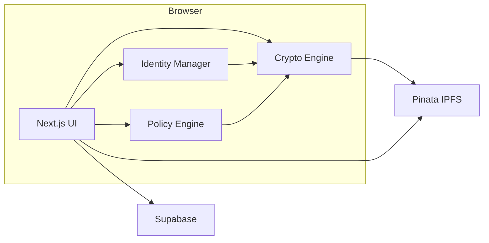
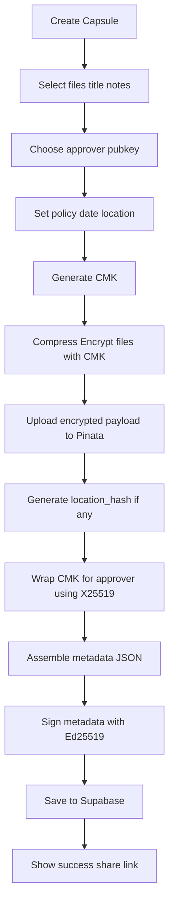
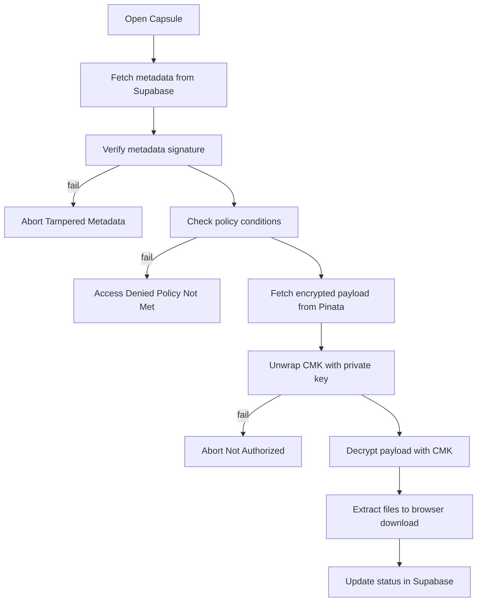
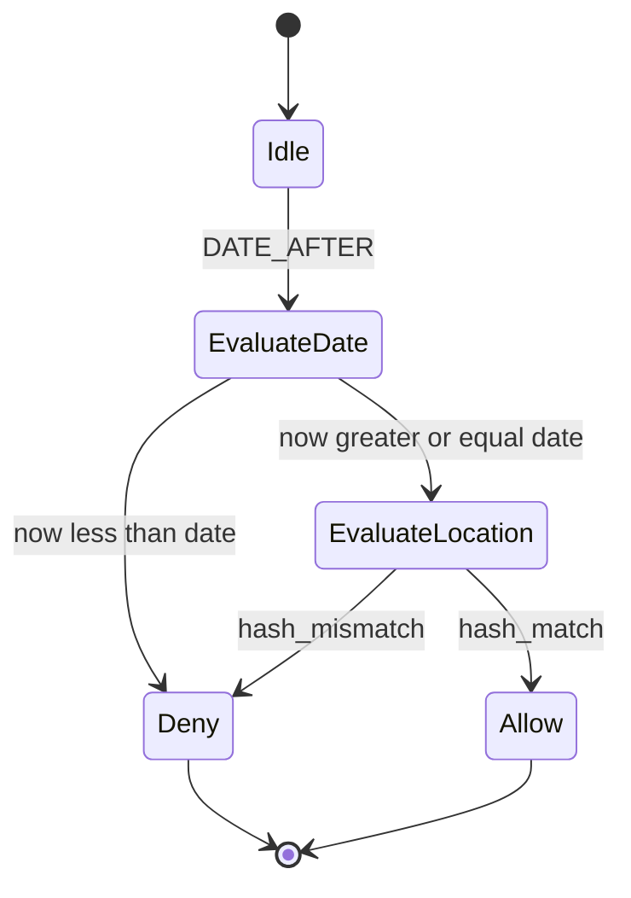
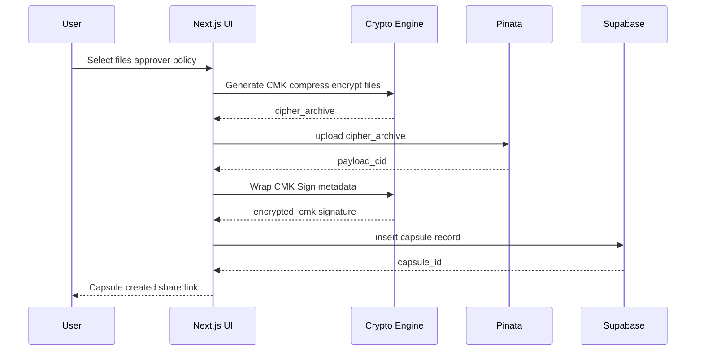
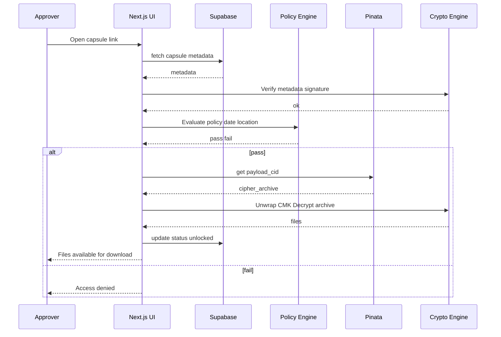

# TrustCircle Lite Web — Full Build Specification

A web-based, privacy-first, single-approver secure data sharing app built with Next.js and deployed on Vercel. All encryption happens client-side in the browser.

---

## 1) Concept

TrustCircle Lite lets you lock files so that exactly one named approver can unlock them under specific environmental conditions like date/time and location. It is designed to feel like a physical safe: you need to be at the right time/place and hold the right private key.

Core objectives:
- Single approver: a single designated person has the authority to unlock.
- Two-factor by environment: unlock requires both device conditions and key possession.
- Client-side privacy: encryption and policy checks happen in the browser before any upload.
- Decentralized storage: encrypted payloads stored on IPFS via Pinata.
- Easy sharing: capsule metadata stored in Supabase for discovery.

Non-goals for v1:
- Multi-approver thresholds or quorum workflows.
- Server-side key escrow or recovery.
- Continuous background tracking of user location.

---

## 2) User Stories

- As a creator, I can encrypt files into a capsule and specify a single approver, plus optional time and location policy.
- As the approver, I can unlock a capsule when the local date/time and location match the policy and I possess the correct private key.
- As a creator, I can see the status of my capsules in my dashboard.
- As an approver, I can verify the capsule metadata authenticity and policy before attempting unlock.
- As a user, I can share a capsule via URL or QR code.

---

## 3) System Architecture Overview

- Next.js web app performs all crypto and policy checks in browser.
- Encrypted payloads stored on IPFS via Pinata.
- Supabase stores capsule metadata and user inventory.
- All encryption happens client-side before upload.



Key interactions:
- Creation: Browser Crypto -> Pinata IPFS -> Supabase metadata.
- Unlock: Supabase metadata -> Pinata IPFS -> Browser Crypto decrypt.

---

## 4) Technology Stack

- Framework: Next.js 14 with App Router and TypeScript
- Deployment: Vercel
- UI: Tailwind CSS and shadcn/ui components
- Crypto: noble-curves for Ed25519 and X25519, Web Crypto API for AES-GCM
- Storage: Pinata for IPFS uploads and retrieval
- Database: Supabase for capsule metadata and user inventory
- Auth: Supabase Auth optional for user accounts
- Geolocation: Browser Geolocation API
- Local persistence: IndexedDB for keys and preferences
- Compression: fflate for file compression

Rationale: modern web stack, zero installation, cross-platform, serverless, client-side encryption.

---

## 5) Data Model

### 5.1 Capsule Components

- Encrypted Payload: compressed archive of user files, encrypted with a randomly generated Capsule Master Key.
- Metadata: public policy, recipient key, encrypted CMK, signatures, integrity nonces.

### 5.2 Metadata Schema

```json
{
  "version": "1.0",
  "capsule_id": "uuid-v4-string",
  "creator_pubkey": "ed25519:BASE64_PUB",
  "approver_pubkey": "ed25519:BASE64_PUB",
  "payload_cid": "IPFS_CID_FOR_ENCRYPTED_ARCHIVE",
  "created_at": "2025-10-30T12:34:56Z",
  "unlock_policy": {
    "conditions": [
      {
        "type": "DATE_AFTER",
        "value": "2025-12-01T00:00:00Z"
      },
      {
        "type": "LOCATION_HASH_EQ",
        "value": "BASE64_HASH",
        "precision": 2,
        "algo": "SHA256",
        "salt": "BASE64_SALT"
      }
    ],
    "logic": "ALL" 
  },
  "encrypted_cmk": {
    "scheme": "x25519+aes256gcm",
    "ciphertext": "BASE64",
    "ephemeral_pub": "x25519:BASE64",
    "nonce": "BASE64"
  },
  "metadata_sig": {
    "alg": "ed25519",
    "signature": "BASE64"
  },
  "hints": {
    "title": "Taxes 2025",
    "notes": "Unlock at office"
  }
}
```

Notes:
- LOCATION_HASH generation: hash of salt, rounded lat/lon, and day_utc.
- The metadata_sig covers all fields except itself to prevent tampering.
- The encrypted CMK is wrapped to the approver public key.

### 5.3 Supabase Schema

Capsules table:
```sql
create table capsules (
  id uuid primary key default gen_random_uuid(),
  creator_pubkey text not null,
  approver_pubkey text not null,
  title text,
  notes text,
  payload_cid text not null,
  metadata jsonb not null,
  status text default 'locked',
  created_at timestamp default now(),
  unlocked_at timestamp
);

create index idx_capsules_creator on capsules(creator_pubkey);
create index idx_capsules_approver on capsules(approver_pubkey);
```

Row Level Security:
- Users can read capsules where their pubkey matches creator or approver.
- Users can insert capsules with their pubkey as creator.
- Users can update status of capsules where their pubkey matches approver.

---

## 6) Cryptographic Design

- Data Encryption: CMK 32 bytes -> AES-256-GCM via Web Crypto API.
- CMK Wrapping: ECIES-style using X25519:
  - Sender generates ephemeral X25519 key pair.
  - Derive shared secret with approver X25519 public key.
  - KDF: HKDF-SHA256 -> 32-byte key.
  - AEAD: AES-256-GCM to encrypt CMK with random nonce.
  - Store ciphertext, ephemeral public, nonce in metadata.
- Identity:
  - Ed25519 key pair for signing metadata.
  - X25519 key pair for key agreement.
- Metadata Integrity:
  - metadata_sig.signature = Ed25519Sign of serialized metadata.
- Policy Privacy:
  - Location details reduced to salted hash; actual coordinates never stored.

Key sizes:
- Ed25519/X25519: 32-byte keys.
- HKDF: info label "TCL-CMK-WRAP".
- Nonce: 12 bytes for AES-GCM.

---

## 7) Application Flows

### 7.1 Capsule Creation



### 7.2 Capsule Unlock



### 7.3 Policy Evaluation



---

## 8) Module Design and APIs

### 8.1 Identity Manager

- generateIdentity: returns Ed25519 and X25519 keypairs
- loadIdentity: returns keys from IndexedDB
- exportPublicProfile: returns public keys for sharing

### 8.2 Policy Engine

- buildLocationHash: lat, lon, date, precision, salt -> base64
- evaluate: policy, device_context -> pass or fail
- device_context: now_utc, lat, lon

### 8.3 Crypto Engine

- encryptPayload: files -> cipher_archive, cmk
- decryptPayload: cipher_archive, cmk -> files
- wrapCmkForRecipient: cmk, recipient_x25519_pub -> ciphertext, ephemeral_pub, nonce
- unwrapCmk: ciphertext, recipient_x25519_priv, ephemeral_pub, nonce -> cmk
- signMetadata: metadata, ed25519_priv -> signature
- verifyMetadata: metadata, ed25519_pub -> bool

### 8.4 Pinata Client

- uploadBytes: bytes -> cid
- getBytes: cid -> bytes

### 8.5 Supabase Client

- saveCapsule: record -> id
- updateStatus: capsule_id, status -> void
- listCapsules: filters -> capsules array
- getCapsule: capsule_id -> capsule

---

## 9) Error Model and UX Copy

- Tampered Metadata: "This capsule details are invalid. It may have been altered."
- Policy Not Met: 
  - Date: "This capsule is not available yet."
  - Location: "You are not in the required unlock area."
- Unauthorized: "Your key does not match the authorized approver."
- Network: "Unable to reach storage. Check connectivity."

All errors should be non-technical, with a Details toggle for logs.

---

## 10) Threat Model

Adversaries:
- Passive observer of IPFS: sees encrypted payloads and metadata.
- Active modifier: attempts to replace metadata or payload.
- Unauthorized user: tries to unlock without private key.
- Location spoofing attempts.

Assets:
- CMK, decrypted files, policy integrity, approver identity.

Risks and Mitigations:
- Metadata tampering -> Ed25519 signature verification on metadata.
- Payload substitution -> Optional payload manifest hash included in metadata.
- Key theft -> IndexedDB encryption, passphrase-protected private keys.
- Location spoofing -> Use salted, coarse-grained hash; allow optional secondary factors.
- Traffic analysis -> Client-side encryption; metadata reveals only hashes and public keys.
- Replay attacks -> Nonces in CMK wrap; signed timestamps; versioned metadata.

---

## 11) Privacy Considerations

- Never store raw coordinates in metadata; only salted hashes.
- Keep location precision coarse to reduce specificity.
- Optional: allow unlock with only DATE_AFTER for users in sensitive regions.
- No telemetry by default; optional opt-in for anonymous error reporting.

---

## 12) Performance and Reliability

- Payload size: compress before encrypt for smaller CIDs.
- Streaming encryption/decryption for large archives to reduce memory usage.
- Retry/backoff for Pinata and Supabase interactions.
- Browser cache for recently accessed payloads with integrity checks.

---

## 13) Build and Deployment

- Environments: dev local, preview Vercel, prod Vercel.
- Config via .env.local for Pinata API keys and Supabase credentials.
- Deployment: git push triggers Vercel build and deploy.
- Edge Functions: optional for metadata relay or rate limiting.

---

## 14) Testing Strategy

- Unit tests:
  - Crypto primitives with Vitest.
  - Policy evaluation edge cases.
  - Metadata signing and verification.
- Integration tests:
  - Full create to unlock loop with test Supabase.
  - Tampering scenarios.
- E2E tests:
  - Playwright for browser flows.
  - Simulated geolocation and clock scenarios.
- Security tests:
  - Fuzzing of metadata parser.
  - Negative tests for nonce reuse.

---

## 15) MVP Scope

- Single approver.
- DATE_AFTER and LOCATION_HASH_EQ conditions with ALL logic.
- Browser-based identity with exportable public keys.
- Encrypted payload upload to Pinata IPFS.
- Supabase stores capsule metadata for easy sharing.
- Responsive web UI works on desktop and mobile.

Out of scope for MVP:
- Native mobile apps.
- Recovery flows, multi-approver, remote policy updates.

---

## 16) Roadmap

- Phase 1: Next.js setup, crypto engine, Pinata integration, Supabase schema
- Phase 2: Create and unlock flows, inventory UI, key management
- Phase 3: Policy engine, geolocation, testing, security audit
- Phase 4: PWA support, optional Supabase Auth, sharing features

---

## 17) Example Code

Creation:

```typescript
const cmk = crypto.getRandomValues(new Uint8Array(32))
const archive = await compress(files)
const cipherArchive = await aesGcmEncrypt(cmk, archive)
const payloadCid = await pinata.upload(cipherArchive)

const locHash = useLocation ? buildLocationHash(lat, lon, dateUtc, precision, salt) : null
const policy = buildPolicy(dateAfter, locHash)

const wrap = await wrapCmkForRecipient(cmk, approverX25519Pub)
const metadata = assembleMetadata(payloadCid, policy, wrap)
const metadataSig = await ed25519Sign(metadata, creatorEd25519Priv)
metadata.metadata_sig = { alg: "ed25519", signature: toBase64(metadataSig) }

await supabase.from('capsules').insert({ 
  metadata, 
  payload_cid: payloadCid,
  creator_pubkey: creatorPubkey,
  approver_pubkey: approverPubkey,
  title,
  notes
})
```

Unlock:

```typescript
const { data } = await supabase.from('capsules').select('*').eq('id', capsuleId).single()
const metadata = data.metadata
assert(await verifyMetadata(metadata, metadata.creator_pubkey))

if (!evaluate(metadata.unlock_policy, deviceContext())) {
  throw new PolicyError()
}

const cipherArchive = await pinata.get(metadata.payload_cid)
const cmk = await unwrapCmk(metadata.encrypted_cmk, approverX25519Priv)
const archive = await aesGcmDecrypt(cmk, cipherArchive)
const files = await decompress(archive)

await supabase.from('capsules').update({ 
  status: 'unlocked', 
  unlocked_at: new Date() 
}).eq('id', capsuleId)
```

---

## 18) Sequence Diagrams

Create Capsule:



Unlock Capsule:


